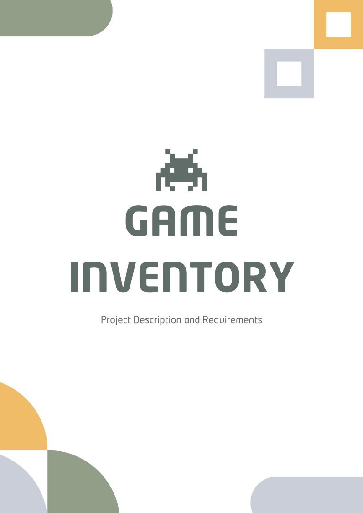

# 1. Introduction

## 1.1 Purpose

The purpose of this web application is to provide a platform for managing video games, including operations for genres, publishers, studios, and video games. Users will also be able to filter and search for video games based on various criteria. The application will feature a beautiful user interface to enhance user experience.

This project is intended for practicing software development as a hobby project. It is part of [The Odin Project](https://www.theodinproject.com/)’s curriculum.

## 1.2 Intended Audience

This document serves as my personal reference during the development of the application. Once completed, the web application will be accessible to anyone interested in managing and exploring video game data.

## 1.3 Key Considerations
1. Users will have the ability to add, edit, or delete data as needed.
2. There will be no authentication; all users will view the same data.
3. Admins are defined as users who possess the admin password.
4. Any operations that could alter or delete data will require password validation.
5. [PEGI](https://es.wikipedia.org/wiki/Pan_European_Game_Information) and [ESRB](https://es.wikipedia.org/wiki/Entertainment_Software_Rating_Board) ratings will be stored in the database as static entries, without any available CRUD operations.
6. The application is designed to operate in a web-hosted environment.
7. A relational database will be used to effectively manage video game data.
8. Images will be hosted on a cloud service, such as Cloudinary, and referenced by URLs rather than being stored as binary large objects (BLOBs) in the database.
9. These requirements are subject to change.

## 1.4 Definitions and Acronyms

- **CRUD: Create, Read, Update, Delete**

  CRUD represents the four basic operations for managing data in an application: creating new records, reading or retrieving existing records, updating existing data, and deleting records when necessary.

- **ESRB: Entertainment Software Rating Board**

  The ESRB is an organization that assigns age and content ratings to video games in North America, helping consumers understand the suitability of games for different age groups.

- **PEGI: Pan European Game Information**

  PEGI provides age ratings for video games in Europe, offering guidance on the appropriateness of games based on their content, ensuring informed choices for consumers.

- **UI: User Interface**

  UI refers to the elements through which users interact with an application or system, including layout, buttons, and navigation tools, aimed at creating an intuitive user experience.

# 2. System Features and Requirements

## 2.1 Functional Requirements

### 2.1.1 Genres Management Module

| **Identifier**  | **FR 001-01 - Add Genre**|
| --------------- | ------------------------ |
| **Actor** | User/Admin|
| **Objective** | Add a new genre to the database|
| **Description** | <ol><li>User navigates to the “Genre” section.</li><li>User clicks the “Add” button.</li><li>User fills in the fields for genre name, description, and icon.</li><li>User submits the form.</li><li>The submitted data is validated.</li></ol>|
| **Validations** | <ul><li>Genre name must be unique and not null.</li><li>Description must not exceed 500 characters.</li><li>If the image is set with an URL, it must be a valid URL format</li><li>If the logo image is uploaded as a file, its size cannot go over 2 MB.</li></ul>|
| **Results** | 
If validation passes, the genre is added to the database, the user is redirected to the “Genres” section, and a success message is displayed.

If validation fails, an error message is shown, and the genre is not added.
|
 

| **Identifier**  | **FR 001-02 - View Genres** |
| --------------- | ------------------------ |
| **Actor** | User/Admin |
| **Objective** | View all genres in the database |
| **Description** | <ol><li>User navigates to the “Genres” section.</li></ol> |
| **Validations** | None |
| **Results** | 
All genres in the database are shown to the user with their names and logos.
 |
 

| **Identifier**  | **FR 001-03 - View Genre Details** |
| --------------- | ------------------------ |
| **Actor** | User/Admin |
| **Objective** | View details of a specific genre in the database |
| **Description** | <ol><li>User navigates to the “Genres” section.</li><li>User clicks on a specific genre.</li></ol> |
| **Validations** | None |
| **Results** | 
All the details of the genre selected are shown.
 |
 
    
| **Identifier**  | **FR 001-04 - Update Genre** |
| --------------- | ------------------------ |
| **Actor** | Admin |
| **Objective** | Update an existing genre in the database |
| **Description** | <ol><li>Admin navigates to the “Genre” section.</li><li>Admin clicks the “Update” button in one of the genres on display.</li><li>Admin fills in the fields they wish to update along with the required admin password.</li><li>Admin submits the form.</li><li>The submitted data is validated.</li></ol> |
| **Validations** | <ul><li>Admin password must be correct.</li><li>Genre name must be unique and not null.</li><li>Description must not exceed 500 characters.</li><li>If the image is set with an URL, it must be a valid URL format.</li><li>If the image is uploaded as a file, its size cannot go over 2 MB.</li></ul> |
| **Results** | 
If the admin password is incorrect, the operation is canceled, and a failure message is displayed.

If validation passes, the genre is updated in the database, the admin is redirected to the “Genres” section, and a success message is displayed.

If validation fails, an error message is shown, and the genre is not updated.
 |
 

| **Identifier**  | **FR 001-05 - Delete Genre** |
| --------------- | ------------------------ |
| **Actor** | Admin |
| **Objective** | Remove an existing genre from the database. |
| **Description** | <ol><li>Admin navigates to the “Genre” section.</li><li>Admin clicks the “Delete” button in one of the genres on display.</li><li>Admin inputs the required admin password.</li><li>Admin submits the form.</li><li>The submitted data is validated.</li></ol> |
| **Validations** | <ul><li>Admin password must be correct.</li></ul> |
| **Results** | 
If the admin password is incorrect, the operation is canceled, and a failure message is displayed.

If validation passes, the genre is deleted from the database, the admin is redirected to the “Genres” section, and a success message is displayed.
 |
 

## 2.1.2 Publishers Management Module

| **Identifier**  | **FR 002-01 - Add Publisher** |
| --------------- | ------------------------ |
| **Actor** | User/Admin |
| **Objective** | Add a new publisher to the database |
| **Description** | <ol><li>User navigates to the “Publisher” section.</li><li>User clicks the “Add” button.</li><li>User fills in the fields for publisher name, description, and icon.</li><li>User submits the form.</li><li>The submitted data is validated.</li></ol> |
| **Validations** | <ul><li>Publisher name must be unique and not null.</li><li>Description must not exceed 500 characters.</li><li>If the image is set with an URL, it must be a valid URL format.</li><li>If the logo image is uploaded as a file, its size cannot go over 2 MB.</li></ul> |
| **Results** | 
If validation passes, the publisher is added to the database, the user is redirected to the “Publishers” section, and a success message is displayed.

If validation fails, an error message is shown, and the publisher is not added.
 |
 

| **Identifier**  | **FR 002-02 - View Publishers** |
| --------------- | ------------------------ |
| **Actor** | User/Admin |
| **Objective** | View all publishers in the database |
| **Description** | <ol><li>User navigates to the “Publishers” section.</li></ol> |
| **Validations** | None |
| **Results** | 
All publishers in the database are shown to the user with their names and logos.
 |
 

| **Identifier**  | **FR 002-03 - View Publisher Details** |
| --------------- | ------------------------ |
| **Actor** | User/Admin |
| **Objective** | View details of a specific publisher in the database |
| **Description** | <ol><li>User navigates to the “Publishers” section.</li><li>User clicks on a specific publisher.</li></ol> |
| **Validations** | None |
| **Results** | 
All the details of the selected publisher are shown.
 |
 

| **Identifier**  | **FR 002-04 - Update Publisher** |
| --------------- | ------------------------ |
| **Actor** | Admin |
| **Objective** | Update an existing publisher in the database |
| **Description** | <ol><li>Admin navigates to the “Publishers” section.</li><li>Admin clicks the “Update” button in one of the publishers on display.</li><li>Admin fills in the fields they wish to update along with the required admin password.</li><li>Admin submits the form.</li><li>The submitted data is validated.</li></ol> |
| **Validations** | <ul><li>Admin password must be correct.</li><li>Publisher name must be unique and not null.</li><li>Description must not exceed 500 characters.</li><li>If the image is set with a URL, it must be a valid URL format.</li><li>If the image is uploaded as a file, its size cannot exceed 2 MB.</li></ul> |
| **Results** | 
If the admin password is incorrect, the operation is canceled, and a failure message is displayed.

If validation passes, the publisher is updated in the database, the admin is redirected to the “Publishers” section, and a success message is displayed.

If validation fails, an error message is shown, and the publisher is not updated.
 |
 

| **Identifier**  | **FR 002-05 - Delete Publisher** |
| --------------- | ------------------------ |
| **Actor** | Admin |
| **Objective** | Remove an existing publisher from the database. |
| **Description** | <ol><li>Admin navigates to the “Publishers” section.</li><li>Admin clicks the “Delete” button in one of the publishers on display.</li><li>Admin inputs the required admin password.</li><li>Admin submits the form.</li><li>The submitted data is validated.</li></ol> |
| **Validations** | <ul><li>Admin password must be correct.</li></ul> |
| **Results** | 
If the admin password is incorrect, the operation is canceled, and a failure message is displayed.

If validation passes, the publisher is deleted from the database, the admin is redirected to the “Publishers” section, and a success message is displayed.
 |
 

## 2.1.3 Studios Management Module

| **Identifier**  | **FR 003-01 - Add Studio** |
| --------------- | ------------------------ |
| **Actor** | User/Admin |
| **Objective** | Add a new studio to the database |
| **Description** | <ol><li>User navigates to the “Studio” section.</li><li>User clicks the “Add” button.</li><li>User fills in the fields for studio name, description, and icon.</li><li>User submits the form.</li><li>The submitted data is validated.</li></ol> |
| **Validations** | <ul><li>Studio name must be unique and not null.</li><li>Description must not exceed 500 characters.</li><li>If the image is set with a URL, it must be a valid URL format.</li><li>If the logo image is uploaded as a file, its size cannot go over 2 MB.</li></ul> |
| **Results** | 
If validation passes, the studio is added to the database, the user is redirected to the “Studios” section, and a success message is displayed.

If validation fails, an error message is shown, and the studio is not added.
 |
 

| **Identifier**  | **FR 003-02 - View Studios** |
| --------------- | ------------------------ |
| **Actor** | User/Admin |
| **Objective** | View all studios in the database |
| **Description** | <ol><li>User navigates to the “Studios” section.</li></ol> |
| **Validations** | None |
| **Results** | 
All studios in the database are shown to the user with their names and logos.
 |
 

| **Identifier**  | **FR 003-03 - View Studio Details** |
| --------------- | ------------------------ |
| **Actor** | User/Admin |
| **Objective** | View details of a specific studio in the database |
| **Description** | <ol><li>User navigates to the “Studios” section.</li><li>User clicks on a specific studio.</li></ol> |
| **Validations** | None |
| **Results** | 
All the details of the selected studio are shown.
 |
 

| **Identifier**  | **FR 003-04 - Update Studio** |
| --------------- | ------------------------ |
| **Actor** | Admin |
| **Objective** | Update an existing studio in the database |
| **Description** | <ol><li>Admin navigates to the “Studios” section.</li><li>Admin clicks the “Update” button in one of the studios on display.</li><li>Admin fills in the fields they wish to update along with the required admin password.</li><li>Admin submits the form.</li><li>The submitted data is validated.</li></ol> |
| **Validations** | <ul><li>Admin password must be correct.</li><li>Studio name must be unique and not null.</li><li>Description must not exceed 500 characters.</li><li>If the image is set with a URL, it must be a valid URL format.</li><li>If the image is uploaded as a file, its size cannot exceed 2 MB.</li></ul> |
| **Results** | 
If the admin password is incorrect, the operation is canceled, and a failure message is displayed.

If validation passes, the studio is updated in the database, the admin is redirected to the “Studios” section, and a success message is displayed.

If validation fails, an error message is shown, and the studio is not updated.
 |
 

| **Identifier**  | **FR 003-05 - Delete Studio** |
| --------------- | ------------------------ |
| **Actor** | Admin |
| **Objective** | Remove an existing studio from the database |
| **Description** | <ol><li>Admin navigates to the “Studios” section.</li><li>Admin clicks the “Delete” button in one of the studios on display.</li><li>Admin inputs the required admin password.</li><li>Admin submits the form.</li><li>The submitted data is validated.</li></ol> |
| **Validations** | <ul><li>Admin password must be correct.</li></ul> |
| **Results** | 
If the admin password is incorrect, the operation is canceled, and a failure message is displayed.

If validation passes, the studio is deleted from the database, the admin is redirected to the “Studios” section, and a success message is displayed.
 |
 

## 2.1.4 Video Games Management Module

| **Identifier**  | **FR 004-01 - Add Video Game** |
| --------------- | ------------------------ |
| **Actor** | User/Admin |
| **Objective** | Add a new video game to the database |
| **Description** | <ol><li>User navigates to the “Video Games” section.</li><li>User clicks the “Add” button.</li><li>User fills in the fields for title, release date (date-picker), description, website, whether it has won a GOTY, game type (indie, AAA, AA, etc.), ratings-related inputs, images (either drag and drop/load or add URL), platforms (from a dropdown), and genres, publishers, and studios from dropdowns which also let the user add new entries by redirecting the user to the respective addition page.</li><li>User submits the form.</li><li>The submitted data is validated.</li></ol> |
| **Validations** | <ul><li>Title is required and must not exceed 255 characters.</li><li>Release date is required.</li><li>Cover image is required.</li><li>Description is required.</li><li>Rating is required with the respective numerical range for IGN, Metacritic, and OpenCritic.</li><li>At least one platform is required.</li><li>At least one genre is required.</li><li>At least one publisher is required.</li><li>At least one studio is required.</li><li>Images uploaded as files cannot go over 2 MB.</li><li>All URLs must be of valid format.</li></ul> |
| **Results** | 
If validation passes, the video game is added to the database, the user is redirected to the “Video Games” section, and a success message is displayed.

If validation fails, an error message is shown, and the video game is not added.
 |
 

| **Identifier**  | **FR 004-02 - View Video Games** |
| --------------- | ------------------------ |
| **Actor** | User/Admin |
| **Objective** | View all video games in the database |
| **Description** | <ol><li>User navigates to the “Video Games” section.</li></ol> |
| **Validations** | None |
| **Results** | 
All video games in the database are shown to the user with their cover images, titles, ratings, and platforms.
 |
 

| **Identifier**  | **FR 004-03 - View Video Game Details** |
| --------------- | ------------------------ |
| **Actor** | User/Admin |
| **Objective** | View details of a specific video game in the database |
| **Description** | <ol><li>User navigates to the “Video Games” section.</li><li>User clicks on a specific video game.</li></ol> |
| **Validations** | None |
| **Results** | 
All the details of the selected video game are shown.
 |
 

| **Identifier**  | **FR 004-04 - Update Video Game** |
| --------------- | ------------------------ |
| **Actor** | Admin |
| **Objective** | Update an existing video game in the database |
| **Description** | <ol><li>Admin navigates to the “Video Games” section.</li><li>Admin clicks the “Update” button in one of the video games on display.</li><li>Admin fills in the fields they wish to update along with the required admin password.</li><li>Admin submits the form.</li><li>The submitted data is validated.</li></ol> |
| **Validations** | <ul><li>Title is required and must not exceed 255 characters.</li><li>Release date is required.</li><li>Cover image is required.</li><li>Description is required.</li><li>Rating is required with the respective numerical range for IGN, Metacritic, and OpenCritic.</li><li>At least one platform is required.</li><li>At least one genre is required.</li><li>At least one publisher is required.</li><li>At least one studio is required.</li><li>Images uploaded as files cannot exceed 2 MB.</li><li>All URLs must be of valid format.</li></ul> |
| **Results** | 
If the admin password is incorrect, the operation is canceled, and a failure message is displayed.

If validation passes, the video game is updated in the database, the admin is redirected to the “Video Games” section, and a success message is displayed.

If validation fails, an error message is shown, and the video game is not updated.
 |
 

| **Identifier**  | **FR 004-05 - Delete Video Game** |
| --------------- | ------------------------ |
| **Actor** | Admin |
| **Objective** | Remove an existing video game from the database |
| **Description** | <ol><li>Admin navigates to the “Video Games” section.</li><li>Admin clicks the “Delete” button in one of the video games on display.</li><li>Admin inputs the required admin password.</li><li>Admin submits the form.</li><li>The submitted data is validated.</li></ol> |
| **Validations** | <ul><li>Admin password must be correct.</li></ul> |
| **Results** | 
If the admin password is incorrect, the operation is canceled, and a failure message is displayed.

If validation passes, the video game is deleted from the database, the admin is redirected to the “Video Games” section, and a success message is displayed.
 |
 

## 2.1.5 Search Functionality Module

Grouped Results with "See All" Button Clarification:
When performing a Search All, results will be grouped by entity type (e.g., video games,
Studios, Publishers, Platforms, Genres).
The first 3 results for each entity type will be displayed initially.
Each group will have a "See All" button or link to view the full list of matching results for that
entity type.
Clicking the "See All" button will take the user to a page displaying all results for that entity
type (e.g., all matching video games, all matching publishers, etc.).

| **Identifier**  | **FR 005-01 - Search in Video Games Section** |
| --------------- | ------------------------ |
| **Actor** | User/Admin |
| **Objective** | Allow users to search for video games by title or across all entities |
| **Description** | <ol><li>The user navigates to the video games section.</li><li>The search bar offers a dropdown with the following options:<ul><li>Search in video games (default): Searches for video games based on the search term.</li><li>Search All: Searches across all entities (video games, studios, publishers, platforms, genres), returning results grouped by entity type with a "See All" link to view more results.</li></ul></li><li>The user enters a search term and selects the desired option.</li><li>The search is executed according to the selected option.</li></ol> |
| **Validations** | <ul><li>The search term must not be empty.</li></ul> |
| **Results** | 
If the search term is empty, no results are shown.

If Search in video games is selected, the user is shown video games that match the search term.

If Search All is selected, the user is shown results from all entities (video games, studios, publishers, platforms, genres) grouped by type, with "See All" links for each group.
 |
 

| **Identifier**  | **FR 005-02 - Search When Viewing a Specific Video Game** |
| --------------- | ------------------------ |
| **Actor** | User/Admin |
| **Objective** | Allow users to search for other video games or across all entities when viewing a specific video game's details |
| **Description** | <ol><li>The user navigates to the page of a specific video game (e.g., "Tales of Arise").</li><li>The search bar offers a dropdown with the following options:<ul><li>Search in video games (default): Searches for other video games.</li><li>Search All: Searches across all entities, grouped by type, with "See All" links to view more results.</li></ul></li><li>The user enters a search term and selects the desired option.</li><li>The search is executed according to the selected option.</li></ol> |
| **Validations** | <ul><li>The search term must not be empty.</li></ul> |
| **Results** | 
If the search term is empty, no results are shown.

If Search in video games is selected, the user is shown video games that match the search term.

If Search All is selected, the user is shown results from all entities, grouped by type, with "See All" links.
 |
 

| **Identifier**  | **FR 005-03 - Search in Other Entity Sections (Studios, Genres, Publishers, Platforms)** |
| --------------- | ------------------------ |
| **Actor** | User/Admin |
| **Objective** | Allow users to search within the current entity section or across all entities |
| **Description** | <ol><li>The user navigates to the Studios, Genres, Publishers, or Platforms section.</li><li>The search bar offers a dropdown with the following options:<ul><li>Search in [Current Entity] (default, e.g., "Search in Studios"): Searches only within the current entity.</li><li>Search All: Searches across all entities, grouped by entity type, with "See All" links to view more results for each group.</li></ul></li><li>The user enters a search term and selects the desired option.</li><li>The search is executed according to the selected option.</li></ol> |
| **Validations** | <ul><li>The search term must not be empty.</li></ul> |
| **Results** | 
If the search term is empty, no results are shown.

If Search in [Current Entity] is selected, the user is shown results from that entity.

If Search All is selected, the user is shown results from all entities, grouped by type, with "See All" links for each group.
 |
 

| **Identifier**  | **FR 005-04 - Search When Viewing a Specific Entity (Studios, Genres, Publishers, Platforms)** |
| --------------- | ------------------------ |
| **Actor** | User/Admin |
| **Objective** | Allow users to search for video games associated with the specific entity or across all entities |
| **Description** | <ol><li>The user navigates to the page of a specific entity (e.g., a studio like "Tango Gameworks").</li><li>The search bar offers a dropdown with the following options:<ul><li>Search in [Specific Entity] (e.g., "Search in Tango Gameworks"): Searches for video games associated with that specific entity (e.g., games developed by "Tango Gameworks").</li><li>Search in [Entity Type] (e.g., "Search in Studios"): Searches within the same entity type (e.g., studios).</li><li>Search All: Searches across all entities, grouped by type, with "See All" links to view more results.</li></ul></li><li>The user enters a search term and selects the desired option.</li><li>The search is executed according to the selected option.</li></ol> |
| **Validations** | <ul><li>The search term must not be empty.</li></ul> |
| **Results** | 
If the search term is empty, no results are shown.

If Search in [Specific Entity] is selected, the user is shown video games associated with that entity.

If Search All is selected, the user is shown results across all entities, grouped by type, with "See All" links.
 |
 

## 2.1.6 Filter Functionality Module

| **Identifier**  | **FR 006-01 - Filter Video Games** |
| --------------- | ------------------------ |
| **Actor** | User/Admin |
| **Objective** | Allow users to filter video games based on various criteria |
| **Description** | <ol><li>The user navigates to the video games section.</li><li>The filter options will include the following criteria:<ul><li>Alphabetical Order:<ul><li>A-Z: Displays video games in ascending order.</li><li>Z-A: Displays video games in descending order.</li></ul></li><li>Rating:<ul><li>Top to Bottom: Displays video games with the highest average ratings first.</li><li>Bottom to Top: Displays video games with the lowest average ratings first.</li></ul></li><li>ESRB Rating: Filter by specific ESRB ratings.</li><li>PEGI Rating: Filter by specific PEGI ratings.</li><li>Added Date:<ul><li>Newest to Oldest: Displays recently added video games first.</li><li>Oldest to Newest: Displays the earliest added video games first.</li></ul></li><li>Release Date:<ul><li>Newest to Oldest: Displays the most recently released games first.</li><li>Oldest to Newest: Displays the earliest released games first.</li></ul></li></ul></li><li>The user selects the desired filter criteria from the dropdown menus.</li><li>The user clicks the "Apply Filter" button.</li><li>The system processes the filter criteria and displays the results accordingly.</li></ol> |
| **Validations** | <ul><li>At least one filter criterion must be selected.</li></ul> |
| **Results** | 
The user is presented with a filtered and sorted list of video games based on the selected criteria.
 |
 

| **Identifier**  | **FR 006-02 - Filter Other Entities (Studios, Genres, Publishers, Platforms)** |
| --------------- | ------------------------ |
| **Actor** | User/Admin |
| **Objective** | Allow users to filter studios, genres, publishers, or platforms based on alphabetical order and creation date |
| **Description** | <ol><li>The user navigates to the relevant entity section (e.g., Studios, Genres, Publishers, Platforms).</li><li>The filter options will include:<ul><li>Alphabetical Order:<ul><li>A-Z: Displays entities in ascending order.</li><li>Z-A: Displays entities in descending order.</li></ul></li><li>Added Date:<ul><li>Newest to Oldest: Displays recently added entities first.</li><li>Oldest to Newest: Displays the earliest added entities first.</li></ul></li></ul></li><li>The user selects the desired filter criteria from the dropdown menus.</li><li>The user clicks the "Apply Filter" button.</li><li>The system processes the filter criteria and displays the results accordingly.</li></ol> |
| **Validations** | <ul><li>At least one filter criterion must be selected.</li></ul> |
| **Results** | 
The user is presented with a filtered and sorted list of entities based on the selected criteria.
 |
 

## 2.2 Non-Functional Requirements

### 2.2.1 User-Friendly Interface:
The application must provide a user-friendly interface that facilitates intuitive navigation.
### 2.2.2 Responsive Design:
The design should be responsive, ensuring optimal functionality and appearance across various devices, including desktops, tablets, and mobile phones.
### 2.2.3 Performance Score:
The application should achieve a Lighthouse performance score of at least **90%** to guarantee optimal performance and a positive user experience.
### 2.2.4 Deployment:
The application should be deployed on a Platform as a Service (PaaS) that maintains uptime without needing to restart after periods of inactivity.
### 2.2.5 Accessibility:
The application must adhere to accessibility standards (WCAG 2.1) to ensure usability for all users, including those with disabilities. This includes keyboard navigation, screen reader compatibility, and appropriate color contrast.
### 2.2.6 Translations:
The application must support internationalization (i18n) for translations in both **English** and **Spanish**, allowing users to switch between languages seamlessly.
### 2.2.7 Light/Dark Mode:
The application should provide a toggle option for light mode and dark mode, allowing users to select their preferred visual theme for improved comfort and usability.

                                                                                                                                                                                                                                                                                                                   